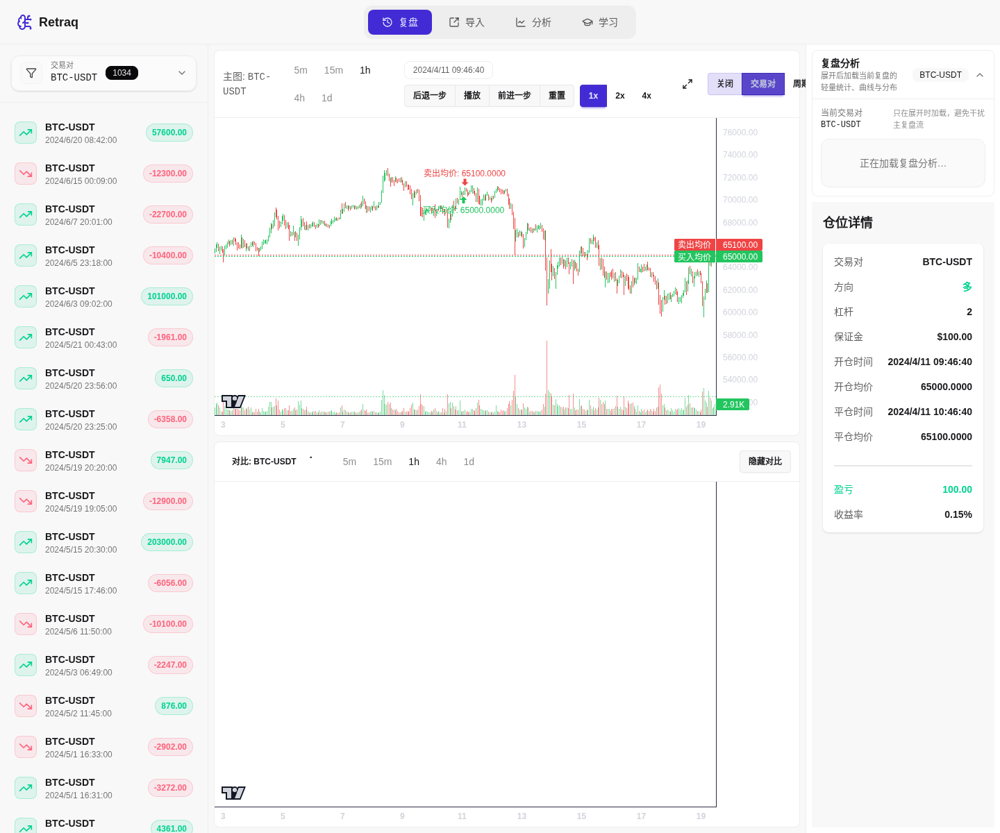
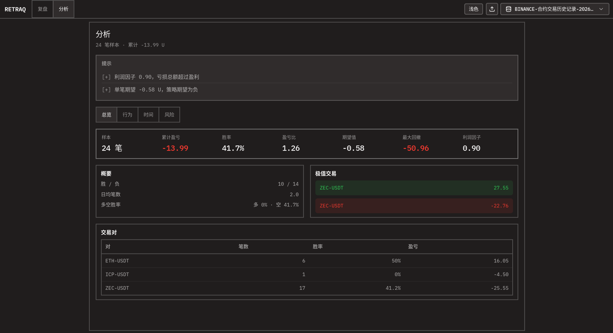

# Retraq

本地交易历史复盘工具：多档案隔离、文件导入交割单，在 K 线上回顾与分析任意交易者的记录。

## 截图





## 功能

- 📈 K线图表 - 从 OKX 获取实时行情数据，支持多周期（5m/15m/1h/4h/1d）
- 🔀 多周期多交易对对比 - 同时查看不同时间周期和交易对的走势
- 📍 买卖点标注 - 明确标注买入卖出点和均价，直观复盘每笔交易
- 📊 交易分析 - 统计胜率、盈亏比、收益曲线等关键指标
- 📥 多模板导入 - 浪哥交割单表格、币安合约仓位历史导出等（按当前档案导入）

## 导入交易记录

在 **设置** 页选择导入模板并上传 `.xlsx` / `.csv`（浪哥模板也支持 csv）。数据写入**当前选中的档案**。

| 模板 | 说明 |
|------|------|
| **浪哥交割单** | 列名与 `samples/langge-delivery-example.xlsx` 一致（设置页可一键导入示例，非必须） |
| **币安 U 本位合约交易历史（推荐）** | 下载中心「合约交易历史」；按成交聚合为开平仓，利润用表内「已实现利润」汇总 |
| **币安 U 本位合约仓位历史** | 下载中心「仓位历史」；已平仓行直接导入 |

### 币安 U 本位合约交易历史（推荐）

1. [下载中心 → 合约交易历史（U 本位）](https://www.binance.com/zh-CN/my/download-center?type=trade-futures-trade-history&child-type=trade-futures-trade-history-u)（路径以币安页面为准）。
2. 设置中选择 **币安 U 本位合约交易历史**，上传 xlsx。
3. 系统按时间将 BUY/SELL 成交合成回合：开仓加权均价、平仓加权均价；**profit = 该回合各笔「已实现利润」之和**（与币安一致）；**profit_rate** 用价差相对开仓价估算；**margin** 用开仓名义价值（无杠杆列时 leverage=1）。

### 币安 U 本位合约仓位历史

1. 登录 [币安](https://www.binance.com)，打开 [下载中心 → 合约仓位历史（U 本位）](https://www.binance.com/zh-CN/my/download-center?type=trade-futures-position-history&child-type=trade-futures-position-history-u)。
2. 选择时间范围并下载 Excel（表头行为「代币名称/币种名称/币对」等，文件内前几行为账户信息）。
3. 在 **设置** 选择模板 **币安 U 本位合约仓位历史** 并上传。系统会按文件名创建/更新数据集并自动切换到该表（默认覆盖，仅含本表仓位）。

导入会映射：交易对、多/空、入场价、平仓均价、结算盈亏、开仓/平仓时间（按 UTC+8 解析）。仅导入状态为 **Closed** 的仓位；杠杆、保证金、收益率等字段导出中无则留空。

## 技术栈

**前端**
- React 19 + TypeScript
- Vite
- TailwindCSS + DaisyUI
- Lightweight Charts

**后端**
- FastAPI
- SQLAlchemy + SQLite
- CCXT (OKX)

## 快速开始

### 环境要求

- Python 3.11+
- Node.js 18+
- pnpm
- uv (Python 包管理器)

### 安装

```bash
# 克隆项目
git clone https://github.com/Xeron2000/retraq.git
cd retraq
```

### 一键启动

**Linux / macOS**
```bash
chmod +x start.sh
./start.sh
```

**Windows**
```cmd
start.bat
```

无「档案」概念：仅**数据集（= 导入的表格）**。设置页上传文件 → 按文件名建数据集并覆盖 → 顶栏切换。首次安装库为空，需自行导入；旧版「默认/浪哥」迁移后可在设置里删除。

启动后访问：
- 前端：http://localhost:9528
- 后端 API：http://localhost:9527

### 手动启动

```bash
# 后端
cd backend
uv sync
uv run python import_data.py  # 导入示例数据
uv run uvicorn main:app --reload --port 9527

# 前端（新终端）
cd frontend
pnpm install
pnpm build
pnpm preview --port 9528 &
```

## 注意事项

- 本项目为个人学习工具，数据存储在本地 SQLite
- K 线数据来自 OKX 公开 API，请遵守交易所服务条款
- 不建议直接暴露到公网，如需公开部署请自行添加认证

## License

MIT License
