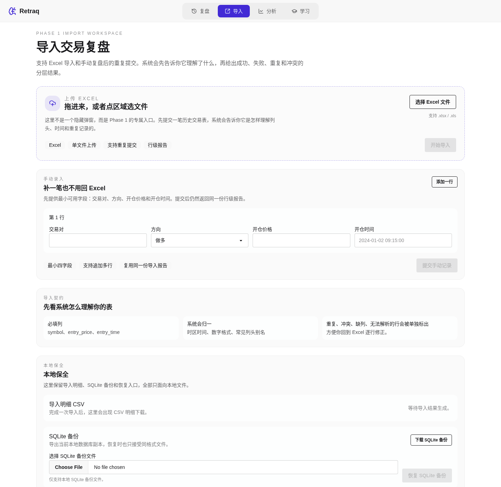

# Retraq

Retraq 是一个本地优先的加密货币交易复盘工具。v1 围绕一条核心主线展开：导入历史交易，快速落到正确的 K 线窗口，补充少量对比与分析，然后把复盘上下文稳定地留在本地，方便反复回看。

## 截图

### 导入工作台

支持 Excel 上传、最小手动录入、行级导入报告，以及本地 SQLite 备份/恢复入口。



### 复盘页面

支持单笔交易 replay、买卖点标注、播放控制、同交易对多周期对比、同周期多交易对对比，以及轻量分析面板。


### 分析页面

提供独立的统计视图，补充时间、行为、风险和币对分布等信息。


## 功能

- 📥 导入工作台：支持 `.xlsx / .xls` 上传，以及最小手动录入；导入后返回统一的成功 / 失败 / 重复 / 冲突报告
- 📄 行级导入报告：失败行、重复行、冲突行、时间归一事件和 CSV 明细导出都可直接查看
- ▶️ 单笔交易 Replay：打开任意一笔交易后，自动落到正确 symbol / 时间窗 / 默认周期，并支持 `play / pause / step / speed`
- 📍 买卖点标注：主图显示开平仓标记与关键价格线，便于快速回看一笔交易的上下文
- 🔀 双 compare 模式：既支持同一交易对的多周期对比，也支持同一周期下的多交易对对比
- 📊 轻量分析：在 replay 侧边栏内查看收益曲线、胜率、盈亏比、交易时段分布、币对分布和回撤等指标
- 💾 本地状态恢复：恢复上次的 replay workspace、比较模式、分析面板状态和逐笔 replay 进度
- 🛟 本地数据保全：支持 SQLite 备份下载、同格式恢复，以及导入明细 CSV 下载

## 技术栈

**前端**
- React 19 + TypeScript
- Vite
- TailwindCSS + DaisyUI
- Lightweight Charts

**后端**
- FastAPI
- SQLAlchemy + SQLite
- CCXT (OKX)

## 快速开始

### 环境要求

- Python 3.11+
- Node.js 18+
- pnpm
- uv (Python 包管理器)

### 安装

```bash
# 克隆项目
git clone https://github.com/Xeron2000/retraq.git
cd retraq
```

### 一键启动

**Linux / macOS**
```bash
chmod +x start.sh
./start.sh
```

**Windows**
```cmd
start.bat
```

启动时会自动导入 `1.xlsx` 中的示例交易数据（仅首次）。

启动后访问：
- 前端：http://localhost:9528
- 后端 API：http://localhost:9527

### 手动启动

```bash
# 后端
cd backend
uv sync
uv run python import_data.py  # 导入示例数据
uv run uvicorn main:app --reload --port 9527

# 前端（新终端）
cd frontend
pnpm install
pnpm build
pnpm preview --port 9528 &
```

## 注意事项

- 本项目为个人学习工具，数据存储在本地 SQLite
- K 线数据来自 OKX 公开 API，请遵守交易所服务条款
- 不建议直接暴露到公网，如需公开部署请自行添加认证
- 手动导入目前提供的是最小字段录入路径：交易对、方向、开仓价格、开仓时间

## License

MIT License
