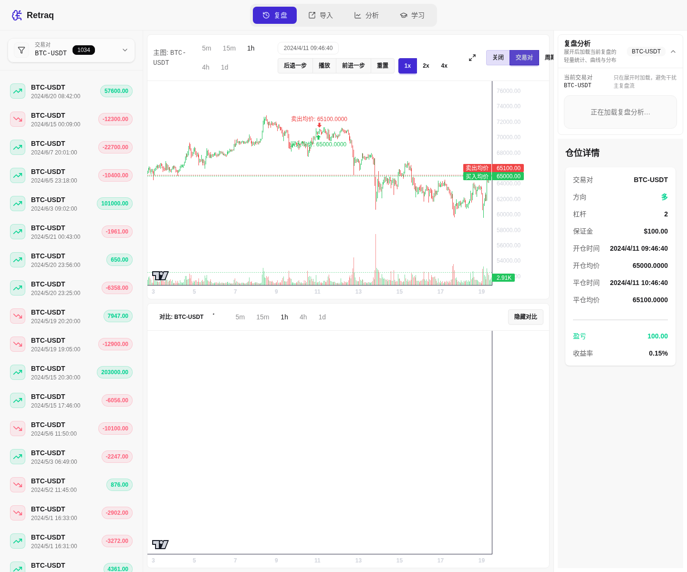
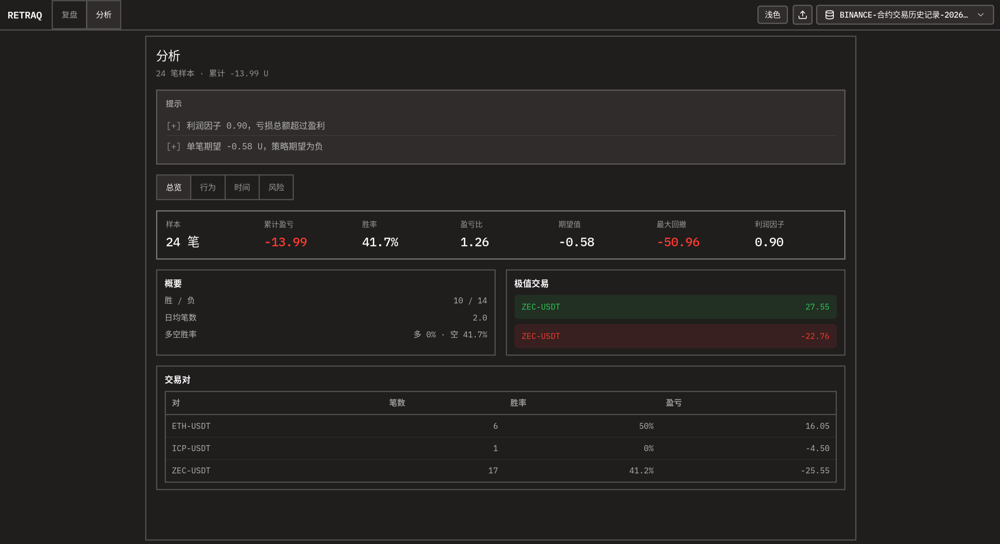

# Retraq

本地交易复盘：导入交割单 → K 线回放 → 统计分析。**一个导入文件 = 一个数据集**，顶栏切换。

## 界面预览

**复盘** — 交易列表 · K 线标注 · 仓位与成交明细



**分析** — 绩效概览 · 行为/时间/风险 · 交易对分布



## 安全说明

**请只在本地或可信内网使用。** 无登录、无鉴权；暴露到公网则他人可读写你的数据。

## 快速开始（Docker Compose）

```bash
git clone https://github.com/Xeron2000/retraq.git && cd retraq
docker compose up -d
```

浏览器打开 **http://localhost:8080**。数据持久化在 Docker 卷 `retraq-data`（容器内 `/data`），删容器不删库。

## 导入数据

1. 顶栏 **上传** `.xlsx` / `.csv`
2. **`template=auto`** 自动识别格式，按文件名创建/覆盖数据集

| 来源 | 说明 |
|------|------|
| 交割单表格 | 表头含「交易对」；示例 `samples/bit-langge-delivery-example.xlsx` |
| 币安 U 本位合约交易历史 | [下载中心](https://www.binance.com/zh-CN/my/download-center?type=trade-futures-trade-history&child-type=trade-futures-trade-history-u) |

库为空时需先导入；K 线需联网（默认 OKX）。

### 同步自己的币安合约实盘

币安私有成交数据不能用用户名（例如 `Xeron23`）查询，必须使用**绑定该账户的 API Key + Secret**。创建只读 Futures API Key，关闭交易与提现权限，然后按运行方式配置：

```bash
# 源码运行：backend/.env
BINANCE_API_KEY=你的只读API_KEY
BINANCE_API_SECRET=你的API_SECRET

# Docker Compose：项目根目录 .env，随后重启容器
BINANCE_API_KEY=你的只读API_KEY
BINANCE_API_SECRET=你的API_SECRET
```

应用不会读取或保存 Binance 登录密码；同步的数据属于 API Key 对应的账户。当前同步范围是 USDⓈ-M 成交及可聚合的已闭合持仓，实时未平仓快照尚未并入复盘数据集。不要把 Key/Secret 发给别人或提交到 Git。

## 其他方式

**从源码构建镜像**（改 `docker-compose.yml` 中 `build: .`，或 `docker compose up --build -d`）

**本地开发**（前后端分离）

```bash
cd backend && uv sync && uv run python import_data.py && uv run uvicorn main:app --reload --port 9527
cd frontend && pnpm install && pnpm dev   # 另开终端，http://localhost:5173
```

### 环境变量（可选）

| 变量 | 默认 | 说明 |
|---|---|---|
| `KLINE_EXCHANGES` | `okx,gate,binance` | K 线回源交易所，按序尝试；`binance` 在受限地区返回 451，故置于末位 |
| `KLINE_WARM_MARKETS` | `1` | 启动时后台预热 ccxt markets（gate 约需 19s）。设 `0` 关闭 |
| `DATABASE_URL` | `sqlite:///./trading.db` | SQLite 以 WAL 模式打开 |

前端与 API 同源（开发走 Vite 代理，镜像内由 FastAPI 托管 `dist`），因此后端**不开启 CORS**：
把前端部署到其他源时，请自行加代理，而不是放开 `allow_origins`。

## License

MIT
